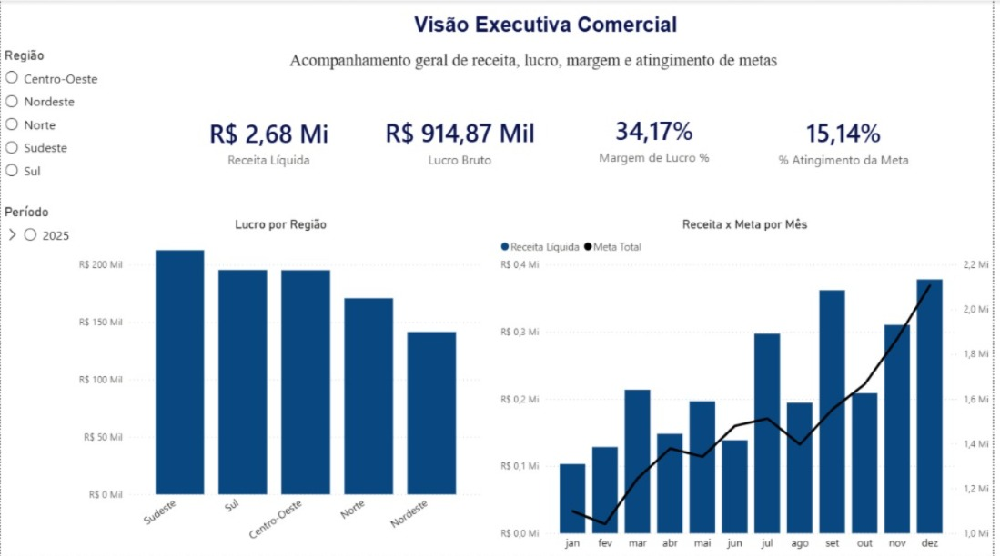
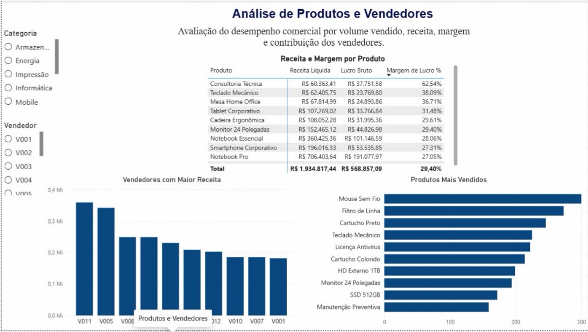
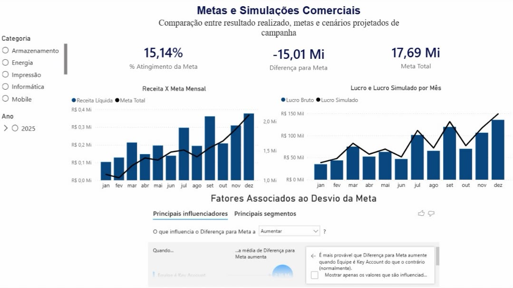

# Dashboard de Vendas — SQL + Power BI

Dashboard desenvolvido em Power BI, com dados tratados e preparados via SQL, para análise de desempenho comercial: receita, lucro, metas e comportamento de vendedores e produtos.

## Contexto
O projeto simula a análise comercial de uma empresa com atuação em múltiplas regiões, permitindo acompanhar receita, lucro, margem, atingimento de metas e desempenho de produtos e vendedores.

*Observação: dados fictícios, utilizados para fins de estudo e portfólio.*

## Indicadores principais (KPIs)
- Receita líquida
- Lucro bruto
- Margem de lucro (%)
- % de atingimento da meta

## Análises disponíveis
- Visão executiva: receita, lucro e margem por região, receita x meta por mês
- Produtos e vendedores: receita e margem por produto, ranking de vendedores, produtos mais vendidos
- Metas e simulações: comparação entre resultado realizado, metas e cenários projetados, fatores associados ao desvio da meta

## Filtros interativos
- Categoria de produto
- Vendedor
- Região
- Período

## Ferramentas utilizadas
SQL (tratamento e preparação dos dados) e Power BI (modelagem, DAX, visualização)

## Estrutura do repositório

    dashboard-vendas-sql-powerbi/
    ├── dashboard-vendas.pbix
    ├── imagem/
    └── README.md

## Prints do dashboard

